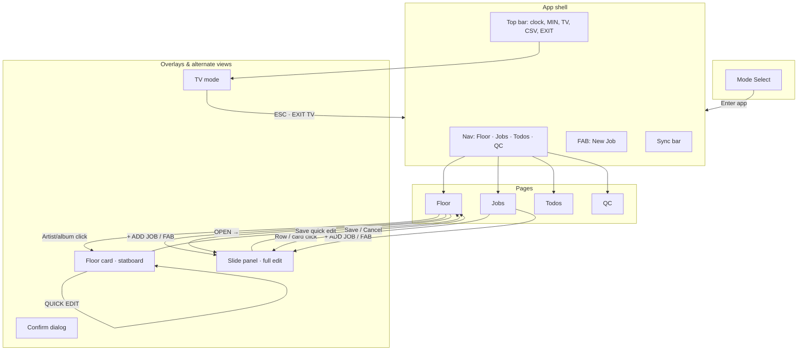
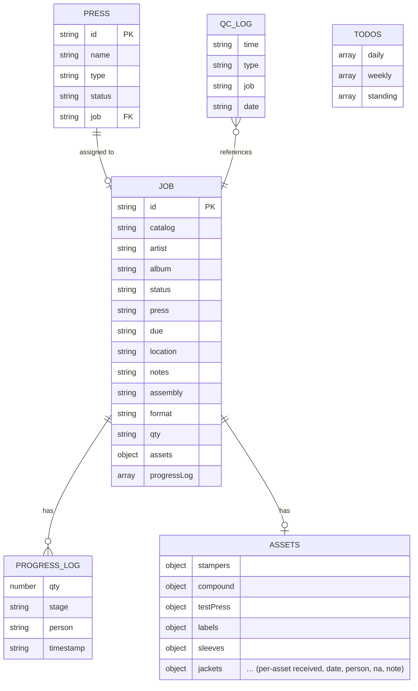

# PMP OPS — Information Architecture

A single-page operations dashboard for vinyl production: **where is every job, what’s on each press, and what’s next.** This document describes the product’s information architecture in three layers—surfaces, flows, and data—with an emphasis on operational clarity.

---

## 1. High-level flow

How people move through the app and where key decisions happen.



**In plain language:**  
Someone chooses **Floor** or **Admin**, then lands in the app shell. The **nav** switches context (Floor, Jobs, Todos, QC). From **Floor**, they can open a **one-job statboard** (floor card) for at-a-glance status, or open the **full edit panel** to change everything. **TV mode** is a separate, read-only view of the same data for the shop floor. All of this sits on one data layer: jobs, presses, todos, QC log, and progress.

---

## 2. Entity relationship (data model)

What the app remembers and how those concepts relate.



**In plain language:**  
The **job** is the center: identity (catalog, artist, album), workflow (status, press, due, location), and specs (format, qty, notes). Each job has **progress entries** (pressed / QC passed / rejected) and an **assets** map (what’s received and by whom). **Presses** point at one job (or none). **QC log** and **todos** are separate lists that reference jobs or stand alone. Persistence is behind a single **storage** abstraction: Supabase when configured, otherwise local (e.g. localStorage).

---

## 3. IA tree (concise)

Where everything lives in the product.

```
PMP OPS
├── Mode select
│   ├── Admin
│   └── Floor
│
├── App shell (after enter)
│   ├── Top bar
│   │   ├── Clock
│   │   ├── MIN (toggle minimal theme)
│   │   ├── TV (enter TV mode)
│   │   ├── ↓ CSV (export)
│   │   └── EXIT
│   ├── Nav
│   │   ├── FLOOR
│   │   ├── JOBS
│   │   ├── TODOS
│   │   └── QC LOG
│   ├── FAB (New job)
│   └── Sync bar
│
├── Floor (default page)
│   ├── Stats row
│   ├── Press status (grid)
│   ├── Active orders (table)
│   │   ├── Row: catalog, artist/album, format, status, due, assets, progress, location, OPEN
│   │   ├── [Artist/album → Floor card]
│   │   └── [OPEN → Slide panel]
│   └── Recently completed
│
├── Jobs
│   ├── Filter + search + ADD JOB + IMPORT CSV
│   ├── Table / cards
│   └── [Row/card → Slide panel]
│
├── Todos
│   ├── Daily
│   ├── Weekly
│   └── Standing
│
├── QC
│   ├── Job picker
│   ├── Log reject (type buttons)
│   ├── Today’s summary
│   ├── Date nav
│   └── Log list
│
├── TV mode (full-screen, replaces app)
│   ├── ESC · EXIT TV
│   ├── Party toggle
│   ├── Clock / date
│   ├── Press cards (job, progress, assets)
│   ├── Queue table
│   └── Ticker
│
├── Slide panel (overlay)
│   ├── Job details
│   ├── Status & press & due
│   ├── Progress log + log stack
│   ├── Notes
│   ├── Optional: invoicing, delete
│   └── SAVE JOB / CANCEL
│
├── Floor card (overlay)
│   ├── One-job statboard (read-only view)
│   ├── QUICK EDIT (toggle)
│   ├── Limited edit: status, press, location, due, notes, assembly
│   └── Close
│
└── Confirm (dialog)
    └── e.g. delete job
```

---

## 4. Information hierarchy (primary, secondary, tertiary)

How the app answers “what do I need to know first?” without overwhelming the room.

**Primary — “Where are we right now?”**  
Always in sight when it matters: **which job is on which press**, **current status** (queued / pressing / assembly / hold / done), **due date**, and **progress** (pressed vs. QC passed vs. rejected vs. pending). On Floor this is the stats row, press grid, and active-orders table. On TV it’s the same story: press cards and queue, large type and clear state. The **floor card** repeats this for a single job so someone standing back can answer “what project is this and where is it?” in one glance.

**Secondary — “What’s the job and what’s left?”**  
Identity (catalog, artist, album), **quantity ordered and progress breakdown**, **asset readiness** (e.g. 8/12 received), **location** (rack, bay, staging), and **format/specs** (LP/7", color, weight). This supports “is this ready to run?” and “where do I find it?” without opening the full form. Shown in table columns, press cards, floor card, and TV in slightly smaller or receded treatment.

**Tertiary — “Full record and admin.”**  
Everything else: invoicing dates, client/label, full notes and assembly notes, progress log history, QC log, and create/edit/delete. This lives in the **slide panel** and optional export. QC and Todos are dedicated surfaces for reject logging and daily/weekly tasks; they’re secondary in the sense of “supporting the line” but primary for the person doing QC or running the list.

**Design intent:**  
The hierarchy keeps **operational clarity** first: one screen (or one floor card) answers “what is this, where is it in the process, what press, how many done, where physically, and is anything blocked?” Secondary and tertiary details are available when someone needs to go deeper, without cluttering the main floor and TV views.

---

## Summary

| Layer | Contents |
|-------|----------|
| **UI surfaces** | Mode select → App shell (bar, nav, FAB, sync) → Floor, Jobs, Todos, QC → Slide panel, Floor card, TV mode, Confirm |
| **Interaction flows** | Enter app → Navigate pages → Open job (panel or floor card) → Full edit in panel / Quick edit in floor card → Tap-to-cycle status, Log QC, Log progress → Todos, CSV import/export → Enter/exit TV, Toggle minimal theme |
| **Data + persistence** | jobs (with progressLog, assets), presses, todos, qcLog → Storage abstraction → Supabase primary, local fallback |

All flows and surfaces use the same in-memory state (`S`) and the same storage interface; the UI never branches on “Supabase vs local,” so the experience stays consistent regardless of backend.
