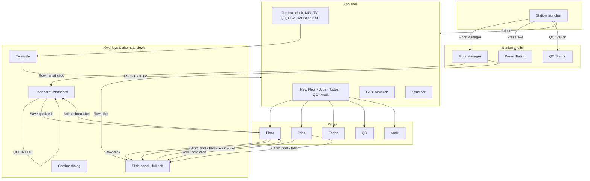
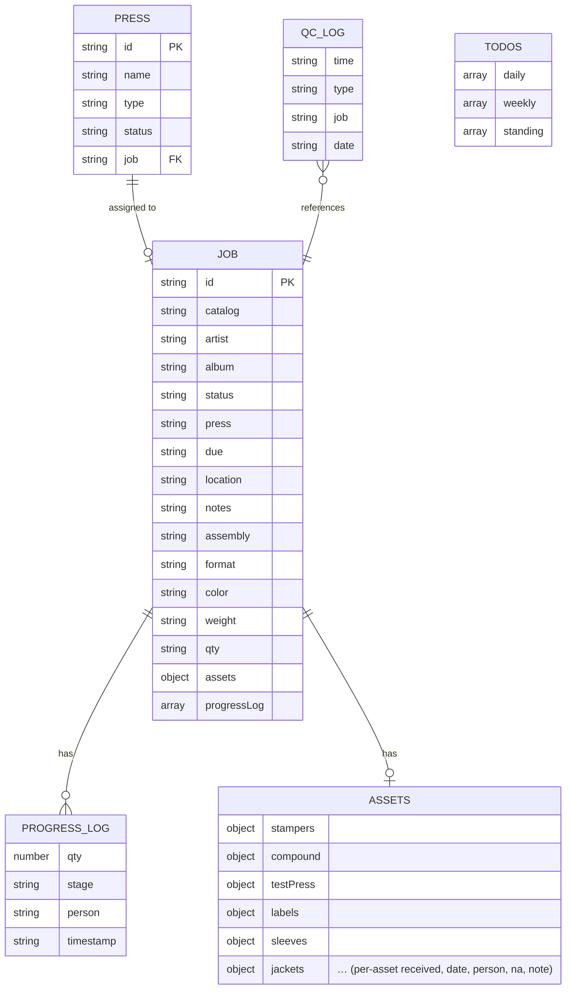

# PMP OPS — Information Architecture

> **Historical IA — superseded by [`INFORMATION-ARCHITECTURE.md`](INFORMATION-ARCHITECTURE.md). Preserved for alternate/unchosen paths.**

---

A single-page operations dashboard for vinyl production: **where is every job, what’s on each press, and what’s next.** This document describes the product’s information architecture in three layers—surfaces, flows, and data—with an emphasis on operational clarity.

---

## 1. High-level flow

How people move through the app and where key decisions happen.



**In plain language:**  
Someone chooses a **station** from the launcher: **Admin** (full app), **Floor Manager** (operations overview; role-based), **Press Station** (single-press view; pick Press 1–4 or 7"), or **QC Station** (rapid reject logging). Admin lands in the app shell; the **nav** switches context (Floor, Jobs, Todos, QC Log, and Audit for admins). From **Floor** (or Floor Manager shell), they can open a **one-job statboard** (floor card) via artist/album click, or the **full edit panel** via row click. **TV mode** is a separate, read-only view for the shop floor. All of this sits on one data layer: jobs, presses, todos, QC log, and progress.

---

## 2. Entity relationship (data model)

What the app remembers and how those concepts relate.



**In plain language:**  
The **job** is the center: identity (catalog, artist, album), workflow (status, press, due, location), and specs (format, color, weight, qty, notes). Each job has **progress entries** (pressed / QC passed / rejected) and an **assets** map (what’s received and by whom). **Presses** point at one job (or none). **QC log** and **todos** are separate lists that reference jobs or stand alone. Persistence is behind a single **storage** abstraction: Supabase when configured, otherwise local (e.g. localStorage).

---

## 3. IA tree (concise)

Where everything lives in the product.

```
PMP OPS
├── Station launcher (mode select)
│   ├── Admin (full app)
│   ├── Floor Manager (role-based; operations overview)
│   ├── Press Station (picker: Press 1–4, 7" Press)
│   ├── QC Station
│   ├── Last choice + OPEN
│   └── Sign out · local/no-role banners
│
├── App shell (Admin after enter)
│   ├── Top bar
│   │   ├── Clock · mode badge
│   │   ├── MIN (toggle minimal theme)
│   │   ├── TV (enter TV mode)
│   │   ├── QC (open QC Station; conditional)
│   │   ├── ↓ CSV (export)
│   │   ├── 💾 BACKUP (admin; conditional)
│   │   └── EXIT
│   ├── Nav
│   │   ├── FLOOR
│   │   ├── JOBS
│   │   ├── TODOS
│   │   ├── QC LOG (badge)
│   │   └── AUDIT (admin only)
│   ├── FAB (New job)
│   └── Sync bar
│
├── Floor (default page)
│   ├── Stats row
│   ├── Press status (grid)
│   ├── Active orders (table, sortable)
│   │   ├── Row: catalog, artist/album, format, color, qty, status, due
│   │   ├── [Artist/album click → Floor card]
│   │   └── [Row click → Slide panel]
│   └── Recently completed
│
├── Jobs
│   ├── Filter + search + ADD JOB + IMPORT CSV
│   ├── Table / cards
│   └── [Row/card → Slide panel]
│
├── Todos
│   ├── Daily
│   ├── Weekly
│   └── Standing
│
├── QC
│   ├── Job picker
│   ├── Log QC passed (qty + LOG PASSED)
│   ├── Log reject (type buttons: FLASH, BLEMISH, etc.)
│   ├── Today’s summary
│   ├── Date nav
│   └── Log list
│
├── Audit (admin only)
│   ├── Limit + LOAD
│   └── Table (when, table, id, action, by, changed fields)
│
├── Floor Manager shell (station)
│   ├── Stats · Press grid · Active orders (same columns as Floor)
│   └── ← BACK
│
├── Press Station shell (station)
│   ├── Single-press view · log qty
│   └── ← BACK
│
├── QC Station shell (station)
│   ├── Current job · Today summary · Select job
│   ├── Log reject · Recent
│   └── ← BACK
│
├── TV mode (full-screen, replaces app)
│   ├── ESC · EXIT TV
│   ├── ◇ PIZZAZ (party / theatrical)
│   ├── Clock / date
│   ├── Press cards (job, progress, assets)
│   ├── Queue table (catalog, artist, format, status, due, assets)
│   └── Ticker
│
├── Slide panel (overlay)
│   ├── Job details
│   ├── Status & press & due
│   ├── Progress log + log stack
│   ├── Notes
│   ├── Optional: invoicing, delete
│   └── SAVE JOB / CANCEL
│
├── Floor card (overlay)
│   ├── One-job statboard (read-only view)
│   ├── QUICK EDIT (toggle)
│   ├── Limited edit: status, press, location, due, notes, assembly
│   └── Close
│
└── Confirm (dialog)
    └── e.g. delete job
```

---

## 4. Information hierarchy (primary, secondary, tertiary)

How the app answers “what do I need to know first?” without overwhelming the room.

**Primary — “Where are we right now?”**  
Always in sight when it matters: **which job is on which press**, **current status** (queued / pressing / assembly / hold / done), **due date**, and **progress** (pressed vs. QC passed vs. rejected vs. pending). On Floor this is the stats row, press grid, and active-orders table. On TV it’s the same story: press cards and queue, large type and clear state. The **floor card** repeats this for a single job so someone standing back can answer “what project is this and where is it?” in one glance.

**Secondary — “What’s the job and what’s left?”**  
Identity (catalog, artist, album), **quantity ordered and progress breakdown**, **color and weight**, **asset readiness** (e.g. 8/12 received), **location** (rack, bay, staging), and **format/specs** (LP/7"). This supports “is this ready to run?” and “where do I find it?” without opening the full form. Shown in table columns (Floor: catalog, artist/album, format, color, qty, status, due; Jobs: fuller set including assets, progress, location), press cards, floor card, and TV in slightly smaller or receded treatment.

**Tertiary — “Full record and admin.”**  
Everything else: invoicing dates, client/label, full notes and assembly notes, progress log history, QC log, and create/edit/delete. This lives in the **slide panel** and optional export. QC and Todos are dedicated surfaces for reject logging and daily/weekly tasks; they’re secondary in the sense of “supporting the line” but primary for the person doing QC or running the list.

**Design intent:**  
The hierarchy keeps **operational clarity** first: one screen (or one floor card) answers “what is this, where is it in the process, what press, how many done, where physically, and is anything blocked?” Secondary and tertiary details are available when someone needs to go deeper, without cluttering the main floor and TV views.

---

## Summary

| Layer | Contents |
|-------|----------|
| **UI surfaces** | Station launcher (Admin, Floor Manager, Press Station, QC Station) → App shell (bar, nav, FAB, sync) → Floor, Jobs, Todos, QC, Audit → Floor Manager / Press Station / QC Station shells → Slide panel, Floor card, TV mode, Confirm |
| **Interaction flows** | Choose station → Enter app or station shell → Navigate pages (admin) → Open job (row → panel; artist/album → floor card) → Full edit in panel / Quick edit in floor card → Tap-to-cycle status, Log QC passed/reject, Log progress → Todos, CSV import/export, Backup → Enter/exit TV, Toggle minimal theme (PIZZAZ), Exit station (← BACK) |
| **Data + persistence** | jobs (with progressLog, assets; fields include color, weight, qty), presses, todos, qcLog → Storage abstraction → Supabase primary, local fallback |

All flows and surfaces use the same in-memory state (`S`) and the same storage interface; the UI never branches on “Supabase vs local,” so the experience stays consistent regardless of backend.
