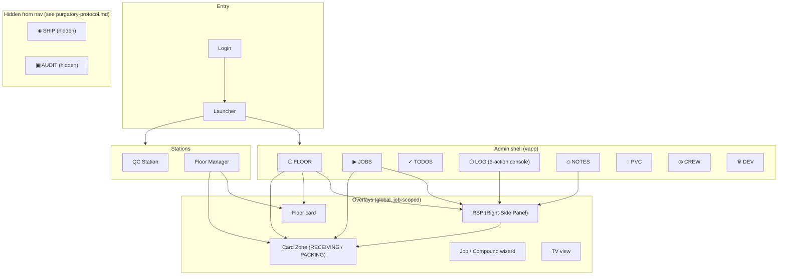

# PMP OPS — Information Architecture v3

**Full information architecture map of the application.**  
Includes one-sheets, visual references, and code-anchored structure.  
*Nashville · Press Floor Operations · physicalmusicproducts.com*

---

## 1. Document purpose and scope

This document is the **single reference** for:

- **Where things live** — screens, overlays, station shells, modals
- **What data exists** — entities, keys, and relationships
- **How users move** — entry → launcher → app or station → key flows
- **Who sees what** — role-to-surface mapping

It is **code-informed** (anchored to `index.html`, `app.js`, `render.js`, `stations.js`, `core.js`, Supabase) and includes **one-sheets** and **diagrams** for quick scanning.

---

## 2. System overview: entry to surface

```
┌─────────────────────────────────────────────────────────────────────────────┐
│  ENTRY                                                                       │
│  ┌─────────────┐     ┌──────────────┐     ┌─────────────────────────────┐  │
│  │ Login       │ ──► │ Launcher     │ ──► │ Admin App  OR  Station      │  │
│  │ #loginScreen│     │ #modeScreen  │     │ (#app)     (#pressStationShell│  │
│  │ (if auth on)│     │ Admin|FM|    │     │             #qcStationShell   │  │
│  │             │     │ Press|QC     │     │             #floorManagerShell│  │
│  └─────────────┘     └──────────────┘     └─────────────────────────────┘  │
└─────────────────────────────────────────────────────────────────────────────┘
```

| Layer | Purpose |
|-------|--------|
| **Login** | Supabase email/password when `SUPABASE_URL` + key set. Guest Demo bypasses. |
| **Launcher** | Role-based: Admin, Floor Manager, Press (p1–p4), QC. Last choice restored on refresh; default-to-floor when no last. |
| **Admin app** | Nav: FLOOR · JOBS · TODOS · LOG · NOTES · PVC · CREW · DEV. SHIP and AUDIT hidden from nav (see purgatory-protocol.md). FAB on Floor/Jobs = New Job. |
| **Stations** | QC / Floor Manager: focused shells with BACK → launcher (or admin if role admin). Press Station purged. |

---

## 3. High-level information architecture map



**Visual: Nav and pages (admin shell)**

```
  BAR: PMP·OPS | [ADMIN/OPERATOR] | clock | MIN · ↓ CSV · 💾 · EXIT

  NAV:  [⬡ FLOOR] [▶ JOBS] [✓ TODOS] [⬡ LOG] [◇ NOTES] [◌ PVC] [◎ CREW] [♛ DEV]
         default    filter    cols    6-action   channel   library  directory  admin
                   +search   daily/  console    +add       cards    +schedule   only
                            weekly   +feed     +feed

  FAB (Floor/Jobs only):  [+]  NEW JOB [N]
```

---

## 4. Data model: entities and relationships

### 4.1 Core entities (code-anchored)

| Entity | Where stored | Key fields (representative) |
|--------|--------------|-----------------------------|
| **Job** | `S.jobs[]`, Supabase `jobs` | id, catalog, artist, album, status, due, press, format, qty, color, notes, notesLog, assemblyLog, progressLog, assets, packCard, poContract, caution, fulfillment_phase, archived_* |
| **Press** | `S.presses[]`, Supabase `presses` | id, name, type, status, job_id, on_deck_job_id |
| **Progress log** | job.progressLog (hydrated from Supabase `progress_log`) | job_id, qty, stage (pressed \| qc_passed \| rejected \| packed \| ready \| shipped \| picked_up \| held), person, timestamp, reason? |
| **QC log** | `S.qcLog[]`, Supabase `qc_log` | time, type, job, date |
| **Todos** | `S.todos{ daily, weekly, standing }`, Supabase `todos` | id, category, text, done, who, sort_order |
| **Notes (job)** | job.notesLog, job.assemblyLog | text, person, timestamp, assetKey?, assetLabel?, attachment_url?, attachment_* |
| **Notes (channels)** | `S.notesChannels{}`, Supabase `notes_channels` | id (!TEAM, !ALERT, jobId), log: [{ text, person, timestamp, attachment_*? }] |
| **Assets (per job)** | job.assets{} | key → { status, date, person, note, received, na, cautionSince } (ASSET_DEFS keys) |
| **Compounds (PVC)** | `S.compounds[]`, Supabase `compounds` | id, number, code_name, amount_on_hand, color, notes, imageUrl |
| **Dev notes** | `S.devNotes[]`, Supabase `dev_notes` | area, text, person, timestamp |

### 4.2 Entity relationship sketch

```
  JOB ◄──────────────────────────────────────────────────────────────┐
   │                                                                   │
   ├── progressLog[]  (from progress_log by job_id)                   │
   │     stages: pressed | qc_passed | rejected                       │
   │              packed | ready | shipped | picked_up | held          │
   ├── notesLog[]     (notes_log JSONB)  ── optional attachment       │
   ├── assemblyLog[]  (assembly_log JSONB)                             │
   ├── assets{}       (assets JSONB)  ── per ASSET_DEFS key            │
   ├── packCard{}     (pack_card JSONB) ── per PACK_DEFS key           │
   ├── caution{}      (caution JSONB)   ── { reason, since, text }     │
   ├── fulfillment_phase  (text)  ── persists; SHIP page hidden         │
   ├── press          (derived from S.presses where job_id = job.id)   │
   └── poContract     (po_contract JSONB, image ref)                    │
                                                                       │
  PRESS ──► job_id (current job)  ────────────────────────────────────┘
         ── on_deck_job_id (optional next job)

  notes_channels ──► id = jobId | !TEAM | !ALERT,  log[] = notes
  qc_log ──► job, type, date, time (denormalized for QC feed)
```

---

## 5. Navigation and page inventory

### 5.1 Admin shell pages (`#app`)

| data-pg | id | Purpose |
|---------|-----|--------|
| floor | pg-floor | Press grid (with ON DECK), stats, floor table, ADD JOB, filter/sort |
| jobs | pg-jobs | Jobs table/cards, filter, search, import CSV, ADD JOB |
| todos | pg-todos | Todo columns (daily, weekly, standing) — optional nav |
| log | pg-log | 6-action console (PRESS · PASS · REJECT · BOXED · READY · QUACK), job picker, numpad, date nav, daily feed. See §6.3. |
| notes | pg-notes | Channel/job picker, + add note (with camera attach), search, notes feed |
| ship | pg-ship | **Hidden from nav.** SHIP page: jobs grouped by fulfillment_phase. Candidate for formal purge. See purgatory-protocol.md. |
| compounds | pg-compounds | PVC toolbar, compound cards, IMPORT CSV, + ADD COMPOUND |
| crew | pg-crew | Directory (table: photo, name, role, specialty, phone, email, notes), CSV import, pfp upload; TODAY schedule block |
| audit | pg-audit | **Hidden from nav.** Audit trail viewer (admin only). Linked from Supabase footer instead. Candidate for formal purge. |
| dev | pg-dev | Dev area select, add note, dev feed (admin only) |

### 5.2 Launcher and stations

| Surface | id / trigger | Purpose |
|---------|----------------|--------|
| Launcher | modeScreen | Admin, Floor Manager, Press (p1–p4), QC; Last: OPEN; Sign out |
| Press Station | pressStationShell | **Purged (2026-03-06).** Formerly: single-press logging shell. Replaced by LOG console (counted movement) and FLOOR press grid (press information). See `docs/purgatory-protocol.md`. |
| QC Station | qcStationShell | Current job, today summary, job list, reject-type buttons, recent log |
| Floor Manager | floorManagerShell | Stats, press grid (with on-deck), active orders table, EDIT → floor card |

### 5.3 Overlays and modals (global)

| Surface | id | Opened by |
|---------|-----|-----------|
| Slide panel | overlay + panel | openPanel(jobId) — job detail/edit, PO image, notes, assets link, progress |
| Floor card | floorCardOverlay | openFloorCard(jobId) — quick edit (status, press, location, due, notes, assembly) |
| Card Zone (RECEIVING) | cardZoneOverlay | openCardZone(jobId, 'asset') — per-asset rows, caution mode, + note, view notes. Green-coded. |
| Card Zone (PACKING) | cardZoneOverlay | openCardZone(jobId, 'pack') — late-stage packing readiness checklist (PACK_DEFS), status cycle. Blue/cyan-coded. |
| New job chooser | (chooser UI) | openNewJobChooser() — blank vs duplicate |
| Compound wizard | compoundWizardWrap | openCompoundWizard() — new/edit compound |
| Confirm dialog | (confirm UI) | openConfirm() — destructive or critical actions |
| PO image lightbox | poImageLightbox | openPoImageLightbox(src) — view (and replace for compound) |
| TV view | tv | enterTV() — fullscreen status board |

---

## 6. One-sheets: major surfaces

### 6.1 FLOOR — One-sheet

| Attribute | Detail |
|-----------|--------|
| **Question answered** | What’s running where, right now? What’s on deck per press? |
| **Primary components** | Stats row, press grid (card + optional ON DECK card per press), floor table (filter/sort), ADD JOB |
| **Press card** | Name, status dot, current job (catalog, artist, format, qty, due), progress bar, assets bar; admin: Assign + ON DECK dropdowns + status |
| **On-deck card** | Dimmed card under press with “ON DECK” + job summary; click head → green ↑ arrow; click arrow → send job to press |
| **Floor table** | Rows: catalog, artist/album, format, color, qty, status, due; tap → panel (admin) or floor card (FM) |
| **Data** | S.presses, S.jobs (filtered by getFloorJobs), getFloorStats |

---

### 6.2 JOBS — One-sheet

| Attribute | Detail |
|-----------|--------|
| **Question answered** | What work exists and how is it configured? |
| **Primary components** | Jobs table, icon-only toolbar (+ add job, ↑ import CSV, ↓ export CSV, ⌕ search toggle). Console shell aesthetic. |
| **Table columns** | Catalog, Artist, Album, Format, Color/Qty, **LIVE** (telemetry dots: green = on press, blue = recent log, per-action colors; PO star; ⚠), **Due** (days delta: grey negative = upcoming, red positive = overdue), **Press** (short name, green = active, glow = logging, grey = on-deck), Assets bar, Progress bar, Location, actions |
| **LIVE column** | No text — only dot/symbol signals. Green pulsing = on press. Per-action colored dots = recent LOG activity within 1 hour. PO star (static = exists, glow = recent upload, click = lightbox). ⚠ = ACHTUNG. After 5 PM + no press activity for 1 hour, green press dots rest. |
| **Actions** | Tap row → RSP; progress bars → Card Zone (RECEIVING or PACKING); admin: full edit |
| **Data** | S.jobs (filtered by search), sortJobsByCatalogAsc, isJobArchived |

---

### 6.3 LOG — One-sheet

| Attribute | Detail |
|-----------|--------|
| **Question answered** | What units moved today — through the press, QC, packing, and out the door? |
| **Architecture** | Single 6-action console. No mode toggle. One numpad, one job picker, one daily feed. All actions visible at once. One source of truth (`job.progressLog`). Console defaults to no action selected. |

#### Actions (6 buttons)

| Button | Color | Stage | Family |
|--------|-------|-------|--------|
| **PRESS** | amber | `pressed` | production |
| **PASS** | green | `qc_passed` | production |
| **REJECT** | red (+ defect picker) | `rejected` | production |
| **BOXED** | cyan | `packed` | ship |
| **READY** | white/neutral | `ready` | ship |
| **QUACK** | bright green | `shipped` | ship |

#### Quantity gates

| Gate | Rule |
|------|------|
| BOXED | packed ≤ qcPassed |
| READY | ready ≤ packed |
| QUACK | shipped ≤ ready |

All percentage rails are calculated against the job's order quantity (`job.qty`).

#### Additional stages (not currently surfaced as console buttons)

`picked_up` and `held` stages still exist in `progressLog` and are counted in progress. `held` requires a reason (BILLING HOLD, CUSTOMER HOLD, DAMAGE, SHORT COUNT, WRONG CONFIG, OTHER). These stages are logged programmatically or through future UI.

#### Console grammar

| Element | Behavior |
|---------|----------|
| **Numpad** | 0–9 / C / ← |
| **LOG button** | Label and color change per selected action (LOG PRESS, LOG BOXED, LOG QUACK, etc.). Button color + glow matches the selected action's color. |
| **Daily feed** | All stages in one feed. Ship-family entries carry `◇` prefix and colored left border. |
| **Rail glow** | Pulsing glow on log (color matches action) |
| **Person/signing** | All entries signed `{surface} · {who}` |

| Data | Location |
|------|----------|
| S.logSelectedJob, logMode, logAction, logViewDate | render.js state |
| progress_log (all stages) | job.progressLog / Supabase `progress_log` |
| qc_log (defect types) | S.qcLog / Supabase `qc_log` |

> **Note on `logMode`**: The variable `logMode` still exists in code as `'press'` or `'ship'` to track which action family is active. The UI mode toggle has been removed — all 6 actions are always visible. `logMode` is set implicitly when an action button is selected (PRESS/PASS/REJECT → `'press'`; BOXED/READY/QUACK → `'ship'`). This is an internal detail, not a user-facing concept.

---

### 6.4 NOTES — One-sheet

| Attribute | Detail |
|-----------|--------|
| **Question answered** | What do we know or need to remember about jobs and the plant? |
| **Primary components** | Channel/job select, + add note, ⌕ search, add row (textarea + camera + ADD), notes feed |
| **Note shape** | text, person, timestamp; optional assetKey, assetLabel; optional attachment_url, attachment_name, attachment_type |
| **Channels** | Job IDs (from S.jobs) or !TEAM, !ALERT; notes in S.notesChannels[id].log or job.notesLog |
| **Attachment** | Camera button → upload → S.notesPendingAttachment → merged on ADD; feed shows circular thumb, click → lightbox |

---

### 6.5 PVC (Compounds) — One-sheet

| Attribute | Detail |
|-----------|--------|
| **Question answered** | What compounds do we have (operational library)? |
| **Primary components** | Toolbar (title, IMPORT CSV, + ADD COMPOUND), compound list (cards: number, name, meta, thumb) |
| **Card** | Thumb (upload/view), number, code_name, amount, color, notes; click → edit compound wizard |
| **Data** | S.compounds (sorted by numeric number), Supabase compounds |

---

### 6.6 SHIP — One-sheet ⚠ HIDDEN

> **Status**: Hidden from nav. Candidate for formal purge. See `docs/purgatory-protocol.md`.
> Runtime still wired (`renderShip()` exists, `goPg('ship')` reachable). Not yet formally purged.

| Attribute | Detail |
|-----------|--------|
| **Question answered** | What jobs are in late-stage fulfillment and what's their shipping state? |
| **Primary components** | Jobs grouped by `fulfillment_phase` columns, clickable rows → RSP, notes/proof context links |
| **Fulfillment phases** | AWAITING INSTRUCTIONS · READY FOR PICKUP · READY TO SHIP · LOCAL PICKUP · IN HOUSE FULFILLMENT · HELD / EXCEPTION · SHIPPED / PICKED UP |
| **Interactions** | Click row → open RSP; notes icon → go to NOTES with job selected; phase select dropdown on each row |
| **Data** | S.jobs filtered by `fulfillment_phase`, `setFulfillmentPhase()` |
| **What replaced it** | LOG SHIP actions (BOXED/READY/QUACK for counted movement), Card Zone PACKING face (readiness), JOBS LIVE column (at-a-glance status) |

---

### 6.7 Right-Side Panel (RSP) — One-sheet

| Attribute | Detail |
|-----------|--------|
| **Question answered** | Full job detail and edit. |
| **Icon Zone** | Top-right control cluster, left to right: **+** (edit toggle) · **☆/★** (PO image: upload if none, lightbox if exists) · **⚠** (ACHTUNG popup → routes to NOTES) · **✕** (close). Icons except `+` are always interactive regardless of edit mode. |
| **Sections** | Job details (FIELD_MAP), PO/Contract (image + fields), Progress, Notes, Assembly, Card Zone link (RECEIVING/PACKING), actions |
| **ACHTUNG popup** | ⚠ opens a centered popup overlay with reason dropdown + note text. Clicking the popup header (⚠ ACHTUNG) closes the popup and RSP and routes to NOTES with job context. Submitting the note does the same: close popup, close RSP, route to NOTES. |
| **Edit toggle** | First `+` click enters edit mode. Second `+` click triggers the same save flow as the Save button — not a simple toggle-off. |
| **Modes** | View vs edit (`panelEditMode`); suggested status when progress suggests change |
| **Data** | `S.editId`, job from `S.jobs`; save → `Storage.saveJob` |

---

### 6.8 Card Zone — One-sheet

| Attribute | Detail |
|-----------|--------|
| **Question answered** | Is this job's material received? Is it ready to pack? |
| **Surface type** | One job-scoped overlay with two faces. Not a page — no nav item. |
| **Entry points** | JOBS page progress bars · RSP Icon Zone |
| **Exit** | Close button (✕) · Escape key. Changes persist on close via `Storage.saveJob()`. |
| **Toggle** | RECEIVING / PACKING — switches between faces. |

#### RECEIVING face (green-coded)

| Attribute | Detail |
|-----------|--------|
| **Purpose** | Per-job incoming asset readiness (stampers, compound, test press, labels, …). Formerly called "Asset Card." |
| **Rows** | One per ASSET_DEFS: status icon (received / na / caution), name, + add note, ⌕ view notes |
| **Status cycle** | (blank) → received → na → caution → (blank) |
| **Caution mode** | Asset in caution + no new note since caution → row locked; 1.5s delay → green pulse on +; note with timestamp ≥ cautionSince unlocks |
| **Summary** | Compact fraction (e.g. `9/12`). Numerator = received items, denominator = total excluding N/A. ACHTUNG items count as not received. Optional `⚠ N` if ACHTUNG > 0. |
| **Data** | `job.assets[key]`, `job.notesLog`; `cautionSince` per asset |

#### PACKING face (blue/cyan-coded)

| Attribute | Detail |
|-----------|--------|
| **Purpose** | Late-stage packing readiness checklist. Formerly called "Pack Card." |
| **Rows** | One per PACK_DEFS: Sleeve · Jacket · Insert / Extras · Shrink Wrap / Poly · Sticker · Box Label · Special Handling |
| **Status cycle** | (blank) → ready → na → caution → (blank) |
| **Caution behavior** | Same protocol as RECEIVING: flag → require context note → resolve. |
| **Summary** | Compact fraction (e.g. `3/7`). Numerator = ready items, denominator = total excluding N/A. ACHTUNG items count as not ready. Optional `⚠ N` if ACHTUNG > 0. |
| **Data** | `job.packCard{}` (JSONB, keyed by PACK_DEFS key). Each item: `{ status, note, person }`. |

#### Shell and behavior

- Both faces share the same outer shell. Shell has a consistent footprint/min-height regardless of which face is active.
- Card Zone is a live-edit surface — there are no Save/Cancel buttons. Changes are written to `job.assets` or `job.packCard` on close.
- Closing Card Zone persists data via `Storage.saveJob()` and keeps `curAssets` synchronized if the RSP is open for the same job.

#### What belongs where: Card Zone vs LOG vs NOTES

| Concern | Surface | Why |
|---------|---------|-----|
| Is the sleeve confirmed / in-house? | **PACKING** face | Readiness checklist per component |
| Is the test press received? | **RECEIVING** face | Incoming material readiness |
| How many units were packed today? | **LOG** (BOXED action) | Counted movement |
| "Client wants extra insert in west-coast shipment" | **NOTES** | Communication / special handling / proof |
| Job has a packing caution (wrong labels received) | **PACKING** caution → **NOTES** for context | Flag lives on card, explanation lives in notes |
| How many units shipped? | **LOG** (QUACK action) | Counted movement |

---

### 6.10 Floor card — One-sheet

| Attribute | Detail |
|-----------|--------|
| **Question answered** | Quick edit for one job (status, press, location, due, notes, assembly) without full panel. |
| **Visibility** | Used when canUseFullPanel is false (e.g. Floor Manager); otherwise panel. |
| **Data** | S.floorCardJobId; save → job update + syncJobPressFromPresses if press changed |

---

## 7. Flows (key user journeys)

### 7.1 Entry and home

1. Load app → auth bootstrap (login if Supabase auth on).
2. After auth → launcher; optionally **restore last** (open last station) or **default to Floor Manager** if no last.
3. Admin → enter app, nav default FLOOR. Floor Manager / Press / QC → enter station shell.

### 7.2 Log production or ship activity (LOG page)

1. Go to LOG. Console opens with no action selected.
2. Select job in picker.
3. Select action: PRESS · PASS · REJECT · BOXED · READY · QUACK. If REJECT → defect picker.
4. Enter qty on numpad → LOG button (label + color match selected action) → `progress_log` or `qc_log` updated, feed re-rendered. Ship-family entries (BOXED/READY/QUACK) show ◇ prefix and colored left border in feed.

### 7.3 Add note with attachment (NOTES)

1. NOTES → select job or !TEAM/!ALERT.
2. + → add row; optional camera → choose image → upload → “1 image” hint.
3. Type text → ADD → note pushed to job.notesLog or notesChannels[id], with attachment if set.

### 7.4 Set on-deck and send to press (Floor)

1. Admin on Floor → press card: ON DECK dropdown → select job.
2. On-deck card appears under press (dimmed). Click “ON DECK” header → green ↑ arrow appears.
3. Click arrow → sendOnDeckToPress → job assigned to press, on_deck cleared, toast.

### 7.5 Caution asset and note (Card Zone RECEIVING)

1. Open Card Zone for job → RECEIVING face → cycle asset to caution → row locks.
2. After 1.5s, + pulses. Click + → add note → submit → note timestamp ≥ cautionSince → row unlocks.

### 7.6 Check packing readiness (Card Zone PACKING)

1. Open Card Zone from JOBS page progress bar or RSP → switch to PACKING face.
2. Review checklist items — cycle each: (blank) → ready → na → caution.
3. If caution on an item → go to NOTES to add context.
4. Close → card state persisted to `job.packCard` via `Storage.saveJob()`.

---

## 8. Role-to-surface matrix

| Surface | Admin | Floor Manager | Press | QC |
|---------|-------|----------------|-------|-----|
| Launcher | All options | FM, Admin (if allowed) | Press picker | QC |
| FLOOR | Full, assign + on-deck | View, floor card edit | Read (or hidden) | Read (or hidden) |
| JOBS | Full CRUD, panel | Limited edit (permissions) | Read | Read |
| LOG (all actions) | Use | Use | Use (own press, PRESS/PASS/REJECT) | Use (PRESS/PASS/REJECT) |
| NOTES | Use, !ALERT | Use | Use | Use |
| SHIP (hidden) | (not in nav) | (not in nav) | — | — |
| PVC | Full | View/add? (per product) | View | View |
| CREW | Full | View | — | — |
| AUDIT (hidden) | (not in nav, linked from footer) | No | No | No |
| DEV | Yes | No | No | No |
| RSP (Panel) | Full edit | Limited (canUseFullPanel) | Read / limited | Read / limited |
| Floor card | — | Quick edit | — | — |
| Card Zone (RECEIVING/PACKING) | Use (from Jobs/RSP) | Use | — | — |
| Press Station (purged) | — | — | — | — |
| QC Station | Can open | — | — | Yes |
| Floor Manager shell | Can open | Yes | — | — |

*(Exact permission logic: getStationEditPermissions(), mayEnterStation(), applyLauncherByRole().)*

---

## 9. File and responsibility map (concise)

| File | Responsibility |
|------|----------------|
| index.html | Shells: login, launcher, TV, app, nav, all pg-* pages, overlay, RSP, floor card, Card Zone (RECEIVING + PACKING), FAB, sync bar, confirm, wizards, station shells, held picker. |
| app.js | S state, storage wiring, auth, launcher, goPg, updateFAB, RSP/floor card open-close, new job, import/export, notes add (incl. attachment), asset note, saveJob, savePresses, saveTodos, notes channels, realtime/polling, TV enter/exit, theme, RSP Icon Zone (edit toggle, PO star, ACHTUNG popup), Card Zone open/close/save, crew photo upload, logJobProgress, image pipeline helpers, localStorage trust guard. |
| render.js | renderAll entry (page-guarded); stats; buildPressCardHTML, buildOnDeckCardHTML; renderPresses, renderFloor, renderJobs, renderLog (6-action console), renderNotesPage, renderNotesSection, renderCompoundsPage, renderCrewPage, renderShip (hidden); panel body (renderPanel*); floor card; Card Zone (renderAssetsOverlay, renderPackCard); TV; audit table (hidden); dev feed; sort/floor helpers. |
| stations.js | Station context, setAssignment, setPressOnDeck, showOnDeckArrow, sendOnDeckToPress, assignJob, setPressStatus; QC/Floor Manager shells (open, exit, render); syncJobPressFromPresses. Press Station shell purged (2026-03-06). |
| core.js | FIELD_MAP, ASSET_DEFS, PACK_DEFS, DEFAULT_PRESSES, STATUS_ORDER, PROGRESS_STAGES, QC_TYPES, HELD_REASONS; getAssetStatus, assetHealth, assetBarSegmentedHTML; packHealth, getPackItemStatus; getJobProgress (all 8 stages); progressDisplay, progressDualBarHTML; logConsoleRailHTML; dueDelta, pressShortName, isPoRecent; ensureNotesLog; job field hash, duplicate check. |
| supabase.js | loadAllData (jobs, progress_log, presses, todos, qc_log, dev_notes, compounds, notes_channels, employees, schedule_entries); saveJob, savePresses, saveTodos, logProgress, logQC, saveNotesChannels, saveCompounds, saveEmployees, saveScheduleEntries; uploadNoteAttachment, uploadPoImage, uploadCompoundImage, uploadCrewPhoto; getAuditLog; row/column mapping. |
| storage.js | Local fallback, scheduleSave, saveJob, savePresses, saveTodos, saveNotesChannels, saveCompounds, loadAll; pending writes, offline queue; localStorage trust guard (size guard, pruning, failure handling). |
| styles.css | Design tokens (--g, --w, --r, --cy, etc.); layout (bar, nav, pg, press-grid, panel, floor card, Card Zone, NOTES, LOG, PVC, CREW, TV, stations). Console shell aesthetic applied to JOBS, CREW, FLOOR, LOG, PVC, DEV. |

---

## 10. Visual reference: screen hierarchy (ASCII)

```
┌────────────────────────────────────────────────────────────────────────────┐
│  LOGIN (#loginScreen)   OR   LAUNCHER (#modeScreen)                        │
│  [email] [password]         [Admin] [Floor Manager] [Press 1-4] [QC]        │
│  [SIGN IN] [GUEST DEMO]     Last: … [OPEN]  [SIGN OUT]                      │
└────────────────────────────────────────────────────────────────────────────┘
                                      │
         ┌────────────────────────────┼────────────────────────────┐
         ▼                            ▼                            ▼
┌─────────────────┐    ┌─────────────────────────────┐    ┌─────────────────────┐
│  ADMIN APP      │    │  FLOOR MANAGER SHELL        │    │  QC SHELL           │
│  #app           │    │  #floorManagerShell         │    │  #qcStationShell    │
│  Bar + Nav +    │    │  Stats | Press grid |        │    │  Reject buttons     │
│  pg-floor       │    │  Active orders table        │    │  [← BACK] → launcher│
│  pg-jobs        │    │  [EDIT] → floor card        │    │  (Press Station:    │
│  pg-log         │    │  [← BACK] → launcher        │    │   purged)           │
│  pg-notes       │    └─────────────────────────────┘    └─────────────────────┘
│  pg-compounds   │
│  pg-crew        │
│  pg-dev         │
│  (pg-ship,      │
│   pg-audit:     │
│   hidden)       │
│  FAB [+]        │
└────────┬────────┘
         │ overlays (when open)
         ├── #overlay (RSP — Right-Side Panel)
         ├── #floorCardOverlay
         ├── #cardZoneOverlay (RECEIVING / PACKING)
         ├── #compoundWizardWrap
         ├── #poImageLightbox
         ├── #cautionPopup (ACHTUNG)
         └── TV (#tv) — fullscreen
```

---

## 11. Glossary (IA terms)

| Term | Meaning |
|------|---------|
| **Floor** | Page and view of “what’s running where”; press grid + floor table. |
| **RSP (Right-Side Panel)** | Slide-over full job detail/edit. Icon Zone at top-right: + (edit toggle/save) · ☆/★ (PO image) · ⚠ (ACHTUNG popup) · ✕ (close). |
| **Floor card** | Quick-edit overlay for one job (status, press, location, due, notes, assembly). |
| **Assets overlay** | Legacy term. Now the RECEIVING face of **Card Zone**. See Card Zone. |
| **NOTES** | Communication home: job-scoped notes + channels (!TEAM, !ALERT) + optional image attachment. The explanation/context layer for caution, exceptions, and special handling. |
| **LOG** | Counted movement console. Single 6-action interface: PRESS (amber) · PASS (green) · REJECT (red) · BOXED (cyan) · READY (white) · QUACK (bright green). No mode toggle. One numpad, one feed. |
| **LOG PRESS actions** | PRESS / PASS / REJECT. Production family. Stages: `pressed`, `qc_passed`, `rejected`. |
| **LOG SHIP actions** | BOXED / READY / QUACK. Ship family. Stages: `packed`, `ready`, `shipped`. Feed entries prefixed with ◇. |
| **SHIP** | Fulfillment phase page: jobs grouped by `fulfillment_phase`. **Hidden from nav** — candidate for formal purge. See purgatory-protocol.md. |
| **CREW** | Employee directory page with pfp, name, role, specialty, contact. CSV import. Photo upload. TODAY schedule block. |
| **PVC** | Compound library (operational); cards, wizard, CSV import. |
| **On deck** | One optional “next” job per press; shown under press card, send-to-press via arrow. |
| **Caution mode (asset)** | Asset state “needs attention”; requires new note before row unlocks. |
| **Job-level caution** | Exception flag on a job (stuck, billing, traffic jam, etc.). Visible via amber glow/border and ⚠ symbol. RSP Icon Zone ⚠ opens an ACHTUNG popup (reason + note), then routes to NOTES. Floor ⚠ routes directly to NOTES. |
| **Icon Zone** | Top-right cluster of action buttons in the RSP: + (edit toggle/save) · ☆/★ (PO image) · ⚠ (ACHTUNG popup) · ✕ (close). Star, caution, and close are always interactive regardless of edit mode. |
| **PACK CARD** | Legacy term. Now the PACKING face of **Card Zone**. See Card Zone. |
| **Ship feed lane** | Visual distinction for ship-family entries in LOG daily feed: ◇ prefix and colored left border. |
| **Fulfillment phase** | Job field (`fulfillment_phase`). Formerly used by SHIP page for grouping. Field persists in data model; SHIP page is hidden. |
| **HELD_REASONS** | Hold reasons: BILLING HOLD, CUSTOMER HOLD, DAMAGE, SHORT COUNT, WRONG CONFIG, OTHER. |
| **Station** | Focused shell: QC or Floor Manager (launcher choice). Press Station has been purged — see purgatory-protocol.md. |
| **Purge** | Send to purgatory. Remove from active runtime, nav, shortcuts, render paths, and save logic. Document the removal. Code may remain in the repo but must be inert. |
| **Purgatory** | Intentionally decommissioned. Documented. Recoverable. Not part of active runtime behavior. Not visible to users. Not consuming cycles. See `docs/purgatory-protocol.md`. |
| **Delete** | Fully removed from active code. Recoverable only through Git history. No documentation obligation beyond the commit message. |
| **Card Zone** | One overlay object with two faces: **RECEIVING** (incoming material readiness) and **PACKING** (late-stage finishing readiness). Opened from JOBS progress bars or RSP. |
| **RECEIVING** | Card Zone face for incoming asset readiness (records, jackets, inserts, etc.). Green-coded. Formerly called "Asset Card." |
| **PACKING** | Card Zone face for late-stage pack readiness (sleeve, wrap, sticker, etc.). Blue/cyan-coded. |

---

*End of Information Architecture v3. For state and implementation details see STATE-SNAPSHOT.md and code.*
