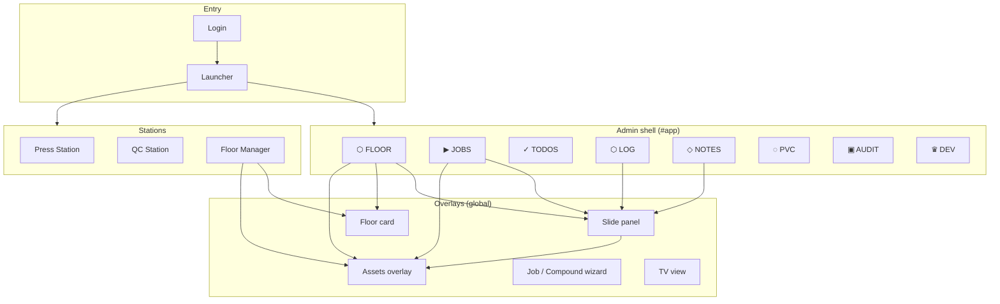

# PMP OPS — Information Architecture v3

**Full information architecture map of the application.**  
Includes one-sheets, visual references, and code-anchored structure.  
*Nashville · Press Floor Operations · physicalmusicproducts.com*

---

## 1. Document purpose and scope

This document is the **single reference** for:

- **Where things live** — screens, overlays, station shells, modals
- **What data exists** — entities, keys, and relationships
- **How users move** — entry → launcher → app or station → key flows
- **Who sees what** — role-to-surface mapping

It is **code-informed** (anchored to `index.html`, `app.js`, `render.js`, `stations.js`, `core.js`, Supabase) and includes **one-sheets** and **diagrams** for quick scanning.

---

## 2. System overview: entry to surface

```
┌─────────────────────────────────────────────────────────────────────────────┐
│  ENTRY                                                                       │
│  ┌─────────────┐     ┌──────────────┐     ┌─────────────────────────────┐  │
│  │ Login       │ ──► │ Launcher     │ ──► │ Admin App  OR  Station      │  │
│  │ #loginScreen│     │ #modeScreen  │     │ (#app)     (#pressStationShell│  │
│  │ (if auth on)│     │ Admin|FM|    │     │             #qcStationShell   │  │
│  │             │     │ Press|QC     │     │             #floorManagerShell│  │
│  └─────────────┘     └──────────────┘     └─────────────────────────────┘  │
└─────────────────────────────────────────────────────────────────────────────┘
```

| Layer | Purpose |
|-------|--------|
| **Login** | Supabase email/password when `SUPABASE_URL` + key set. Guest Demo bypasses. |
| **Launcher** | Role-based: Admin, Floor Manager, Press (p1–p4), QC. Last choice restored on refresh; default-to-floor when no last. |
| **Admin app** | Nav: FLOOR · JOBS · TODOS · LOG · NOTES · PVC · AUDIT · DEV. FAB on Floor/Jobs = New Job. |
| **Stations** | Press / QC / Floor Manager: focused shells with BACK → launcher (or admin if role admin). |

---

## 3. High-level information architecture map



**Visual: Nav and pages (admin shell)**

```
  BAR: PMP·OPS | [ADMIN/OPERATOR] | clock | MIN · ↓ CSV · 💾 · EXIT

  NAV:  [⬡ FLOOR] [▶ JOBS] [✓ TODOS] [⬡ LOG] [◇ NOTES] [◌ PVC] [▣ AUDIT] [♛ DEV]
         default    filter    cols      job+     channel    library   admin     admin
                   +search   daily/     numpad   +add       cards     only      only
                            weekly     +feed

  FAB (Floor/Jobs only):  [+]  NEW JOB [N]
```

---

## 4. Data model: entities and relationships

### 4.1 Core entities (code-anchored)

| Entity | Where stored | Key fields (representative) |
|--------|--------------|-----------------------------|
| **Job** | `S.jobs[]`, Supabase `jobs` | id, catalog, artist, album, status, due, press, format, qty, color, notes, notesLog, assemblyLog, progressLog, assets, poContract, archived_* |
| **Press** | `S.presses[]`, Supabase `presses` | id, name, type, status, job_id, on_deck_job_id |
| **Progress log** | job.progressLog (hydrated from Supabase `progress_log`) | job_id, qty, stage (pressed \| qc_passed \| rejected), person, timestamp |
| **QC log** | `S.qcLog[]`, Supabase `qc_log` | time, type, job, date |
| **Todos** | `S.todos{ daily, weekly, standing }`, Supabase `todos` | id, category, text, done, who, sort_order |
| **Notes (job)** | job.notesLog, job.assemblyLog | text, person, timestamp, assetKey?, assetLabel?, attachment_url?, attachment_* |
| **Notes (channels)** | `S.notesChannels{}`, Supabase `notes_channels` | id (!TEAM, !ALERT, jobId), log: [{ text, person, timestamp, attachment_*? }] |
| **Assets (per job)** | job.assets{} | key → { status, date, person, note, received, na, cautionSince } (ASSET_DEFS keys) |
| **Compounds (PVC)** | `S.compounds[]`, Supabase `compounds` | id, number, code_name, amount_on_hand, color, notes, imageUrl |
| **Dev notes** | `S.devNotes[]`, Supabase `dev_notes` | area, text, person, timestamp |

### 4.2 Entity relationship sketch

```
  JOB ◄──────────────────────────────────────────────────────────────┐
   │                                                                   │
   ├── progressLog[]  (from progress_log by job_id)                   │
   ├── notesLog[]     (notes_log JSONB)  ── optional attachment       │
   ├── assemblyLog[]  (assembly_log JSONB)                             │
   ├── assets{}       (assets JSONB)  ── per ASSET_DEFS key            │
   ├── press          (derived from S.presses where job_id = job.id)   │
   └── poContract     (po_contract JSONB, image ref)                    │
                                                                       │
  PRESS ──► job_id (current job)  ────────────────────────────────────┘
         ── on_deck_job_id (optional next job)

  notes_channels ──► id = jobId | !TEAM | !ALERT,  log[] = notes
  qc_log ──► job, type, date, time (denormalized for QC feed)
```

---

## 5. Navigation and page inventory

### 5.1 Admin shell pages (`#app`)

| data-pg | id | Purpose |
|---------|-----|--------|
| floor | pg-floor | Press grid (with ON DECK), stats, floor table, ADD JOB, filter/sort |
| jobs | pg-jobs | Jobs table/cards, filter, search, import CSV, ADD JOB |
| todos | pg-todos | Todo columns (daily, weekly, standing) — optional nav |
| log | pg-log | Job picker, LOG faceplate (PRESS/PASS/REJECT), numpad, date nav, daily feed |
| notes | pg-notes | Channel/job picker, + add note (with camera attach), search, notes feed |
| compounds | pg-compounds | PVC toolbar, compound cards, IMPORT CSV, + ADD COMPOUND |
| audit | pg-audit | Limit, LOAD, audit table (admin only) |
| dev | pg-dev | Dev area select, add note, dev feed (admin only) |

### 5.2 Launcher and stations

| Surface | id / trigger | Purpose |
|---------|----------------|--------|
| Launcher | modeScreen | Admin, Floor Manager, Press (p1–p4), QC; Last: OPEN; Sign out |
| Press Station | pressStationShell | Single press: current job, log pressed, assign job, status |
| QC Station | qcStationShell | Current job, today summary, job list, reject-type buttons, recent log |
| Floor Manager | floorManagerShell | Stats, press grid (with on-deck), active orders table, EDIT → floor card |

### 5.3 Overlays and modals (global)

| Surface | id | Opened by |
|---------|-----|-----------|
| Slide panel | overlay + panel | openPanel(jobId) — job detail/edit, PO image, notes, assets link, progress |
| Floor card | floorCardOverlay | openFloorCard(jobId) — quick edit (status, press, location, due, notes, assembly) |
| Assets overlay | assetsOverlay | openAssetsOverlay(jobId) — per-asset rows, caution mode, + note, view notes |
| New job chooser | (chooser UI) | openNewJobChooser() — blank vs duplicate |
| Compound wizard | compoundWizardWrap | openCompoundWizard() — new/edit compound |
| Confirm dialog | (confirm UI) | openConfirm() — destructive or critical actions |
| PO image lightbox | poImageLightbox | openPoImageLightbox(src) — view (and replace for compound) |
| TV view | tv | enterTV() — fullscreen status board |

---

## 6. One-sheets: major surfaces

### 6.1 FLOOR — One-sheet

| Attribute | Detail |
|-----------|--------|
| **Question answered** | What’s running where, right now? What’s on deck per press? |
| **Primary components** | Stats row, press grid (card + optional ON DECK card per press), floor table (filter/sort), ADD JOB |
| **Press card** | Name, status dot, current job (catalog, artist, format, qty, due), progress bar, assets bar; admin: Assign + ON DECK dropdowns + status |
| **On-deck card** | Dimmed card under press with “ON DECK” + job summary; click head → green ↑ arrow; click arrow → send job to press |
| **Floor table** | Rows: catalog, artist/album, format, color, qty, status, due; tap → panel (admin) or floor card (FM) |
| **Data** | S.presses, S.jobs (filtered by getFloorJobs), getFloorStats |

---

### 6.2 JOBS — One-sheet

| Attribute | Detail |
|-----------|--------|
| **Question answered** | What work exists and how is it configured? |
| **Primary components** | Filter, search, jobs table (or cards), ADD JOB, Import CSV |
| **Table columns** | Catalog, Artist, Album, Format, Color/Qty, Status, Due, Press, Assets, Progress, Location, actions |
| **Actions** | Tap row → panel; admin: full edit; FM: limited by getStationEditPermissions |
| **Data** | S.jobs (filtered by status/search), sortJobsByCatalogAsc, isJobArchived |

---

### 6.3 LOG — One-sheet

| Attribute | Detail |
|-----------|--------|
| **Question answered** | What units moved today, by job and type (pressed / pass / reject)? |
| **Primary components** | Job picker, faceplate (PRESS / PASS / REJECT), numpad, LOG button, date nav (Prev/Next/Today), daily feed |
| **Actions** | Select job → enter qty → LOG PRESS / LOG PASS / REJECT (defect picker) → writes progress_log / qc_log |
| **Data** | S.logSelectedJob, S.logAction, S.logDate, progress_log (by date), qc_log |

---

### 6.4 NOTES — One-sheet

| Attribute | Detail |
|-----------|--------|
| **Question answered** | What do we know or need to remember about jobs and the plant? |
| **Primary components** | Channel/job select, + add note, ⌕ search, add row (textarea + camera + ADD), notes feed |
| **Note shape** | text, person, timestamp; optional assetKey, assetLabel; optional attachment_url, attachment_name, attachment_type |
| **Channels** | Job IDs (from S.jobs) or !TEAM, !ALERT; notes in S.notesChannels[id].log or job.notesLog |
| **Attachment** | Camera button → upload → S.notesPendingAttachment → merged on ADD; feed shows circular thumb, click → lightbox |

---

### 6.5 PVC (Compounds) — One-sheet

| Attribute | Detail |
|-----------|--------|
| **Question answered** | What compounds do we have (operational library)? |
| **Primary components** | Toolbar (title, IMPORT CSV, + ADD COMPOUND), compound list (cards: number, name, meta, thumb) |
| **Card** | Thumb (upload/view), number, code_name, amount, color, notes; click → edit compound wizard |
| **Data** | S.compounds (sorted by numeric number), Supabase compounds |

---

### 6.6 Panel (slide panel) — One-sheet

| Attribute | Detail |
|-----------|--------|
| **Question answered** | Full job detail and edit. |
| **Sections** | Job details (FIELD_MAP), PO/Contract (image + fields), Progress, Notes, Assembly, Assets (link to assets overlay), actions (Save, Delete, etc.) |
| **Modes** | View vs edit (panelEditMode); suggested status when progress suggests change |
| **Data** | S.editId, job from S.jobs; save → Storage.saveJob |

---

### 6.7 Assets overlay — One-sheet

| Attribute | Detail |
|-----------|--------|
| **Question answered** | Per-job asset readiness (stampers, compound, test press, labels, …) and notes. |
| **Rows** | One per ASSET_DEFS: status (received / na / caution), date, person, + add note, ⌕ view notes; optional detail block (date received, received by, note) |
| **Caution mode** | Asset in caution + no new note since caution → row locked (only + add note or cycle status); 1.5s delay → green pulse on +; note with timestamp ≥ cautionSince unlocks |
| **Data** | job.assets[key], job.notesLog; cautionSince per asset |

---

### 6.8 Floor card — One-sheet

| Attribute | Detail |
|-----------|--------|
| **Question answered** | Quick edit for one job (status, press, location, due, notes, assembly) without full panel. |
| **Visibility** | Used when canUseFullPanel is false (e.g. Floor Manager); otherwise panel. |
| **Data** | S.floorCardJobId; save → job update + syncJobPressFromPresses if press changed |

---

## 7. Flows (key user journeys)

### 7.1 Entry and home

1. Load app → auth bootstrap (login if Supabase auth on).
2. After auth → launcher; optionally **restore last** (open last station) or **default to Floor Manager** if no last.
3. Admin → enter app, nav default FLOOR. Floor Manager / Press / QC → enter station shell.

### 7.2 Log production (LOG page)

1. Go to LOG → select job in picker.
2. Set action (PRESS / PASS / REJECT). If REJECT → defect picker.
3. Enter qty on numpad → LOG PRESS / LOG PASS / etc. → progress_log or qc_log updated, feed re-rendered.

### 7.3 Add note with attachment (NOTES)

1. NOTES → select job or !TEAM/!ALERT.
2. + → add row; optional camera → choose image → upload → “1 image” hint.
3. Type text → ADD → note pushed to job.notesLog or notesChannels[id], with attachment if set.

### 7.4 Set on-deck and send to press (Floor)

1. Admin on Floor → press card: ON DECK dropdown → select job.
2. On-deck card appears under press (dimmed). Click “ON DECK” header → green ↑ arrow appears.
3. Click arrow → sendOnDeckToPress → job assigned to press, on_deck cleared, toast.

### 7.5 Caution asset and note (Assets overlay)

1. Open assets overlay for job → cycle asset to caution → row locks (⌕ disabled, detail hidden).
2. After 1.5s, + pulses. Click + → add note → submit → note timestamp ≥ cautionSince → row unlocks.

---

## 8. Role-to-surface matrix

| Surface | Admin | Floor Manager | Press | QC |
|---------|-------|----------------|-------|-----|
| Launcher | All options | FM, Admin (if allowed) | Press picker | QC |
| FLOOR | Full, assign + on-deck | View, floor card edit | Read (or hidden) | Read (or hidden) |
| JOBS | Full CRUD, panel | Limited edit (permissions) | Read | Read |
| LOG | Use | Use | Use (own press) | Use |
| NOTES | Use, !ALERT | Use | Use | Use |
| PVC | Full | View/add? (per product) | View | View |
| AUDIT | Yes | No | No | No |
| DEV | Yes | No | No | No |
| Panel | Full edit | Limited (canUseFullPanel) | Read / limited | Read / limited |
| Floor card | — | Quick edit | — | — |
| Press Station | Can open any | — | Assigned press | — |
| QC Station | Can open | — | — | Yes |
| Floor Manager shell | Can open | Yes | — | — |

*(Exact permission logic: getStationEditPermissions(), mayEnterStation(), applyLauncherByRole().)*

---

## 9. File and responsibility map (concise)

| File | Responsibility |
|------|----------------|
| index.html | Shells: login, launcher, TV, app, nav, all pg-* pages, overlay, panel, floor card, assets overlay, FAB, sync bar, confirm, wizards, station shells. |
| app.js | S state, storage wiring, auth, launcher, goPg, updateFAB, panel/floor card open-close, new job, import/export, notes add (incl. attachment), asset note, saveJob, savePresses, saveTodos, notes channels, realtime/polling, TV enter/exit, theme. |
| render.js | renderAll entry; stats; buildPressCardHTML, buildOnDeckCardHTML; renderPresses, renderFloor, renderJobs, renderLog, renderNotesPage, renderNotesSection, renderCompoundsPage; panel body (renderPanel*); floor card; assets overlay (renderAssetsOverlay); TV; audit table; dev feed; sort/floor helpers. |
| stations.js | Station context, setAssignment, setPressOnDeck, showOnDeckArrow, sendOnDeckToPress, assignJob, setPressStatus; Press/QC/Floor Manager shells (open, exit, render); press station job select; syncJobPressFromPresses. |
| core.js | FIELD_MAP, ASSET_DEFS, DEFAULT_PRESSES, STATUS_ORDER, PROGRESS_STAGES, QC_TYPES; getAssetStatus, assetHealth, assetBarSegmentedHTML; progressDisplay, progressDualBarHTML; dueClass, dueLabel; ensureNotesLog; job field hash, duplicate check. |
| supabase.js | loadAllData (jobs, progress_log, presses, todos, qc_log, dev_notes, compounds, notes_channels); saveJob, savePresses, saveTodos, logProgress, logQC, saveNotesChannels, saveCompounds; uploadNoteAttachment, uploadPoImage, uploadCompoundImage; getAuditLog; row/column mapping. |
| storage.js | Local fallback, scheduleSave, saveJob, savePresses, saveTodos, saveNotesChannels, saveCompounds, loadAll; pending writes, offline queue. |
| styles.css | Design tokens (--g, --w, --r, etc.); layout (bar, nav, pg, press-grid, panel, floor card, assets overlay, NOTES, LOG, PVC, TV, stations). |

---

## 10. Visual reference: screen hierarchy (ASCII)

```
┌────────────────────────────────────────────────────────────────────────────┐
│  LOGIN (#loginScreen)   OR   LAUNCHER (#modeScreen)                        │
│  [email] [password]         [Admin] [Floor Manager] [Press 1-4] [QC]        │
│  [SIGN IN] [GUEST DEMO]     Last: … [OPEN]  [SIGN OUT]                      │
└────────────────────────────────────────────────────────────────────────────┘
                                      │
         ┌────────────────────────────┼────────────────────────────┐
         ▼                            ▼                            ▼
┌─────────────────┐    ┌─────────────────────────────┐    ┌─────────────────────┐
│  ADMIN APP      │    │  FLOOR MANAGER SHELL        │    │  PRESS / QC SHELL   │
│  #app           │    │  #floorManagerShell         │    │  #pressStationShell │
│  Bar + Nav +    │    │  Stats | Press grid |        │    │  #qcStationShell    │
│  pg-floor       │    │  Active orders table        │    │  Job + numpad or    │
│  pg-jobs        │    │  [EDIT] → floor card        │    │  reject buttons    │
│  pg-log         │    │  [← BACK] → launcher        │    │  [← BACK] → launcher│
│  pg-notes       │    └─────────────────────────────┘    └─────────────────────┘
│  pg-compounds   │
│  pg-audit       │
│  pg-dev         │
│  FAB [+]        │
└────────┬────────┘
         │ overlays (when open)
         ├── #overlay (slide panel)
         ├── #floorCardOverlay
         ├── #assetsOverlay
         ├── #compoundWizardWrap
         ├── #poImageLightbox
         └── TV (#tv) — fullscreen
```

---

## 11. Glossary (IA terms)

| Term | Meaning |
|------|--------|
| **Floor** | Page and view of “what’s running where”; press grid + floor table. |
| **Panel** | Slide-over full job detail/edit (admin or when canUseFullPanel). |
| **Floor card** | Quick-edit overlay for one job (status, press, location, due, notes, assembly). |
| **Assets overlay** | Modal list of per-job assets (ASSET_DEFS) with status, notes, caution mode. |
| **NOTES** | Communication home: job-scoped notes + channels (!TEAM, !ALERT) + optional image attachment. |
| **LOG** | Production logging: press/qc events by job, date, with numpad and reject picker. |
| **PVC** | Compound library (operational); cards, wizard, CSV import. |
| **On deck** | One optional “next” job per press; shown under press card, send-to-press via arrow. |
| **Caution mode** | Asset state “needs attention”; requires new note before row unlocks. |
| **Station** | Focused shell: Press, QC, or Floor Manager (launcher choice). |

---

*End of Information Architecture v3. For state and implementation details see STATE-SNAPSHOT.md and code.*
