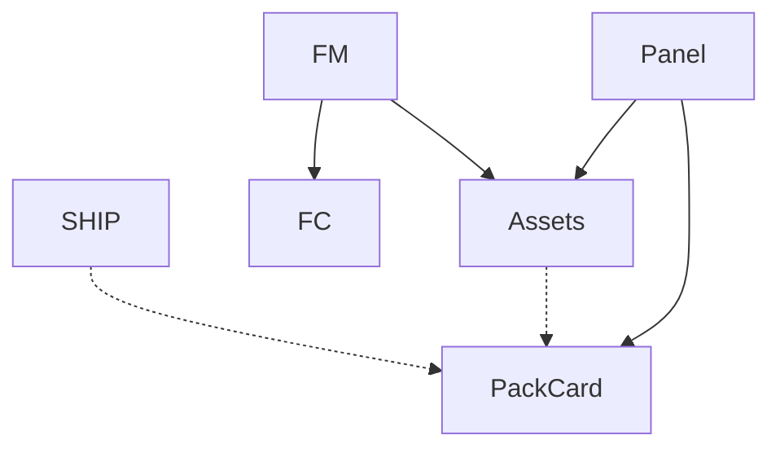

# PACK CARD v1 — Planning Document

**Purpose:** Plan a job-scoped late-stage assembly/packing overlay that answers "are we ready to pack this correctly?" without building a full PACK page or logistics surface.

**Scope:** Read-only planning. No code changes. Optimizes for clean object/surface architecture.

*Nashville · Press Floor Operations · physicalmusicproducts.com*

---

## 1. Executive summary

- **Gap:** After pressing and QC, the actual packing/assembly step has no dedicated surface. Today, packing readiness is derived from scattered signals: asset health (are components in-house?), assembly notes (special instructions), progress (enough QC-passed units?), and free-form notes. There is no single place that says "this job is ready to pack correctly" or "this job has packing-specific context that the packing crew needs to see."
- **Intent:** PACK CARD is a **job-scoped overlay** (not a page) that mirrors the **Assets overlay** pattern — a focused checklist of packing-specific readiness items, each with status, caution, and note linkage. It is NOT a counted-movement console (that's LOG) and NOT a shipping surface (that's SHIP).
- **Architecture:** PACK CARD joins the overlay family alongside Assets overlay, Floor card, and Progress detail. It lives in a new `job.packCard` JSONB field and is driven by a `PACK_DEFS` constant (analogous to `ASSET_DEFS`).
- **Principle:** Same interaction grammar as Assets overlay — flag → require context → resolve — applied to late-stage packing concerns.

---

## 2. What PACK CARD is and is not

### 2.1 PACK CARD *is*

- A **job-scoped overlay/card** showing packing readiness at a glance.
- A **late-stage checklist** of items the packing crew needs to verify before boxing.
- A **caution surface** — any item can be flagged with the same flag → require note → resolve protocol used by Assets.
- A **context surface** — pack-specific special instructions, assembly spec, and notes are reachable from here.
- **Connected to NOTES** — caution on a pack item routes to NOTES for context, just like asset caution.

### 2.2 PACK CARD is *not*

- A **counted-movement console** — LOG records pressed/passed/rejected quantities. PACK CARD does not count units.
- A **shipping surface** — SHIP handles fulfillment phase, shipping state, and proof. PACK CARD is upstream of SHIP: it answers "ready to pack?" not "ready to ship?"
- A **full page** — it is an overlay, opened from job context. No nav item. No standalone route.
- A **replacement for Assets** — Assets tracks whether components are in-house. PACK CARD tracks whether the job is ready to be assembled/packed correctly *given* those components. They are complementary.

---

## 3. IA placement

### 3.1 Surface type: overlay

PACK CARD is an **overlay**, not a page. This matches the existing pattern:

```
Overlays (global, job-scoped)
├── RSP (Right-Side Panel)     — full job detail/edit
├── Floor card                  — quick edit
├── Assets overlay              — per-asset readiness + caution
├── Progress detail             — progress breakdown
└── PACK CARD (new)             — packing readiness + caution
```

**Rationale:**
- Packing readiness is a **job-context concern**, not a plant-wide view.
- It should be reachable from any surface where a job is visible, without navigating away.
- The overlay pattern (open → inspect/act → close) is well-established and understood.

### 3.2 DOM placement

New overlay shell in `index.html`, peer to `#assetsOverlay`:

```
#packCardOverlay
  .pack-card-overlay (backdrop)
    .pack-card-box
      .pack-card-close [✕]
      .pack-card-title [CATALOG · ARTIST]
      .pack-card-summary [ready / caution / remaining counts]
      .pack-card-list [PACK_DEFS rows]
      .pack-card-actions [SAVE & CLOSE, CANCEL]
```

### 3.3 Mermaid update



---

## 4. Entry points

### 4.1 RSP Icon Zone (primary)

Add a **📦** icon to the RSP Icon Zone. This is the primary entry point.

```
Icon Zone: ☆ (PO)  ⚠ (caution)  📦 (pack card)  + (edit)  ✕ (close)
```

**Behavior:** Click 📦 → `openPackCard(jobId)` → pack card overlay opens over the RSP.

**Rationale:**
- The Icon Zone is already the home for exception-style and readiness-style controls (PO star, caution toggle).
- PACK CARD is a readiness surface — it belongs in the same control cluster.
- The 📦 icon should glow/pulse if the job has cautioned pack items (same pattern as ⚠ glowing when job-level caution is active).

### 4.2 Jobs page (secondary)

Add a **pack readiness indicator** to the Jobs table, similar to the existing assets health bar.

**Where:** New column or combined with existing assets column.

**What:** A small readiness summary — e.g. `3/5` or a segmented bar — that is clickable: `onclick="openPackCard(jobId)"`.

**Conditions:** Only show for jobs where pack readiness is relevant (status = assembly, done, or hold; or where `job.packCard` has data). For jobs still in queue/pressing, show `—` or hide.

**Rationale:** Jobs page is the managerial view. Pack readiness is a managerial concern.

### 4.3 Floor card (tertiary — if Floor Manager role packs)

If the Floor Manager role is involved in packing, the Floor card could show:
- A read-only pack readiness summary line (e.g. `Pack: 3/5 ✓`)
- A clickable link to open PACK CARD

**Recommendation:** Include in v1 as a read-only line. Defer edit-from-floor-card to later.

### 4.4 SHIP page (contextual)

Jobs on SHIP are post-production. SHIP could show a pack readiness indicator per row — a small `📦 3/5` or similar — clickable to open PACK CARD.

**Recommendation:** Defer to v1.1. SHIP already has its own information density. Add after PACK CARD is proven useful.

---

## 5. Exit behavior

Consistent with Assets overlay:

| Action | Behavior |
|--------|----------|
| **SAVE & CLOSE** | Persist `job.packCard` → `Storage.saveJob()` → close overlay → re-render |
| **CANCEL** | Discard unsaved changes → close overlay |
| **Backdrop click** | Same as CANCEL (discard + close) |
| **✕ button** | Same as CANCEL |
| **Keyboard: Escape** | Same as CANCEL |

On save, pack card data writes back to `job.packCard` (JSONB on the job row, same persistence pattern as `job.assets`).

---

## 6. Object model

### 6.1 PACK_DEFS — packing checklist items

Analogous to `ASSET_DEFS`. A constant array of packing-relevant items:

```js
const PACK_DEFS = [
  { key: 'components_verified', label: 'Components Verified' },
  { key: 'assembly_spec',       label: 'Assembly Spec Confirmed' },
  { key: 'qc_clearance',        label: 'QC Clearance' },
  { key: 'inserts_placed',      label: 'Inserts / Extras Placed' },
  { key: 'sticker_placement',   label: 'Sticker Placement' },
  { key: 'shrink_poly',         label: 'Shrink Wrap / Poly Bag' },
  { key: 'box_config',          label: 'Box Config (type + per-box qty)' },
  { key: 'special_handling',    label: 'Special Handling' },
];
```

**Design notes:**
- This list is deliberately smaller than ASSET_DEFS (8 items vs 14). Packing is simpler.
- Items can be added later without schema migration (it's JSONB-driven like assets).
- `components_verified` is a meta-check: "did someone look at the assets overlay and confirm everything is actually present and correct, not just received?" This bridges Assets → PACK CARD.
- `qc_clearance` is a meta-check: "do we have enough QC-passed units to pack?" This bridges LOG → PACK CARD.

### 6.2 Per-item data shape

Each item in `job.packCard` follows the same shape as assets:

```js
job.packCard = {
  components_verified: {
    status: 'ready',        // '' | 'ready' | 'na' | 'caution'
    person: 'Mike',
    date: '2026-03-05',
    note: '',
    cautionSince: '',       // ISO-8601 if status === 'caution'
  },
  assembly_spec: { status: '', ... },
  // ...
};
```

**Status cycle:** same as assets:
```
'' (unset) → ready → na → caution → '' (loop)
```

### 6.3 Pack-specific metadata (optional v1.1)

A small optional metadata block on the job for packing context:

```js
job.packMeta = {
  boxType: 'standard',       // or 'custom', 'mailer', etc.
  perBox: 25,                 // units per box
  specialInstructions: '',    // short text
};
```

**Recommendation:** Defer `packMeta` to v1.1. In v1, packing context lives in the `special_handling` item's note field and in NOTES. This avoids premature structure.

### 6.4 Supabase schema

Single migration:

```sql
ALTER TABLE jobs ADD COLUMN IF NOT EXISTS pack_card jsonb;
```

Same pattern as `assets` (JSONB), `caution` (JSONB), `fulfillment_phase` (text).

---

## 7. What belongs where: PACK CARD vs LOG vs NOTES

This is the critical boundary question. Clear separation:

| Concern | Surface | Why |
|---------|---------|-----|
| **"Are components present and correct?"** | PACK CARD (`components_verified`) | This is a readiness check, not a count. Assets overlay says "received"; PACK CARD says "verified at pack time." |
| **"Is QC clearance sufficient?"** | PACK CARD (`qc_clearance`) | Meta-check. The actual counts live in LOG/progress. PACK CARD just records "yes, someone confirmed we have enough." |
| **"Assembly spec confirmed?"** | PACK CARD (`assembly_spec`) | Packing crew confirms they understand the assembly (gatefold, insert placement, etc.). |
| **"How many units pressed/passed/rejected?"** | LOG | Counted movement. PACK CARD does NOT count. |
| **"What happened during packing?"** | NOTES | Communication and context. If a pack item is cautioned, the note goes to NOTES (same as asset caution). |
| **"Special assembly instructions"** | PACK CARD (`special_handling`) + existing `job.assembly` / `job.notes` fields | PACK CARD surfaces the flag; detailed instructions live in existing fields or NOTES. |
| **"Is this ready to ship?"** | SHIP (fulfillment_phase) | PACK CARD answers "ready to pack." SHIP answers "ready to ship." They are sequential. |
| **"Why is packing stalled?"** | PACK CARD caution + NOTES | Flag on PACK CARD, context in NOTES. Same protocol as asset caution. |

### 7.1 The readiness ladder

```
Assets overlay    →  PACK CARD        →  SHIP
"in-house?"          "packable?"          "shippable?"
(pre-production)     (post-QC)            (post-pack)
```

Each surface is a readiness gate for the next phase. They don't overlap — they sequence.

---

## 8. Caution protocol on PACK CARD

Mirrors Assets overlay caution exactly:

| Behavior | Detail |
|----------|--------|
| **Flag** | Cycle item to `caution` → `cautionSince` timestamp recorded |
| **Visual** | Row styled amber, detail fields locked, item name gets "— add note or change state" |
| **Pulse** | After 1.5s, `+` button pulses amber |
| **Resolution** | New note in NOTES with matching context (or status cycled away from caution) clears the lock |
| **Note linkage** | `openAssetNoteComposer` equivalent: `openPackNoteComposer(jobId, packKey)` — note lands in `job.notesLog` with `packKey` as context tag |

**Notes tagging:** Pack card notes should use a `packKey` field (analogous to `assetKey`) so they can be filtered and displayed in context on both PACK CARD and NOTES.

---

## 9. Derived / computed signals (read-only, v1)

PACK CARD can display read-only derived context to help the packing crew without requiring them to look elsewhere:

| Signal | Source | Display |
|--------|--------|---------|
| **Asset health** | `assetHealth(job)` | `Assets: 12/14 ✓` — quick glance without opening Assets |
| **QC passed units** | `progressDisplay(job)` | `QC passed: 850 / 1000 ordered` — is there enough? |
| **Assembly notes** | `job.assembly` | Short text if present — "Gatefold, insert in left pocket" |
| **Job-level caution** | `job.caution` | If cautioned, show pill — packing crew should know |

These are informational rows at the top of the overlay, above the checklist. They help PACK CARD answer "are we ready?" without the user having to leave.

---

## 10. Role relevance

| Role | PACK CARD access | Notes |
|------|------------------|-------|
| **Admin** | Full (read + edit) | Can open from RSP, Jobs, Floor card |
| **Floor Manager** | Full (read + edit) | Primary user — manages packing crew |
| **Press** | Read-only (if visible) | Press operators don't pack, but might glance |
| **QC** | Read-only | QC doesn't pack, but `qc_clearance` is their signal |

---

## 11. Implementation sequence

### Phase 1: Core PACK CARD (smallest useful)

| Step | What | Files | Dependency |
|------|------|-------|------------|
| **1a** | Add `PACK_DEFS` constant to `core.js` | core.js | None |
| **1b** | Add `pack_card` JSONB column to jobs | supabase/ migration | None |
| **1c** | Update `jobToRow()` / `rowToJob()` to include `pack_card` | supabase.js | 1b |
| **1d** | Add `#packCardOverlay` shell to `index.html` | index.html | None |
| **1e** | Add `openPackCard()`, `closePackCard()`, `renderPackCard()` to render.js (or app.js) | render.js, app.js | 1a, 1d |
| **1f** | Implement pack item status cycle (`cyclePackStatus`) with caution protocol | app.js | 1a, 1e |
| **1g** | Add 📦 to RSP Icon Zone | index.html | 1e |
| **1h** | Add pack readiness indicator to Jobs table | render.js | 1a |
| **1i** | Styles for pack card overlay, rows, caution | styles.css | 1d |
| **1j** | Wire save/close (persist to `job.packCard`, same as assets) | app.js, supabase.js | 1c, 1e |

**Estimated scope:** ~300–400 lines across 5 files. Comparable to the original Assets overlay implementation.

### Phase 2: Polish + secondary entry points (v1.1)

| Step | What |
|------|------|
| 2a | Derived signals (asset health, QC count, assembly notes) displayed read-only at top of PACK CARD |
| 2b | Pack note composer (inline, like asset note composer) with `packKey` context tagging |
| 2c | Floor card read-only pack readiness line |
| 2d | SHIP page pack readiness indicator |
| 2e | `packMeta` optional metadata block (box type, per-box qty, special instructions) |
| 2f | Pack health bar on press cards (if relevant — for jobs in assembly status) |

### Phase 3: Future possibilities (not planned)

- Full PACK page (standalone, plant-wide packing queue)
- Pack-specific LOG stage (packed count as a new PROGRESS_STAGE)
- Pack photo/proof (image attachment on pack items)
- Integration with SHIP (auto-advance fulfillment phase when all pack items ready)

---

## 12. Key architectural decisions

| Decision | Choice | Rationale |
|----------|--------|-----------|
| **Overlay, not page** | Overlay | Job-scoped. No plant-wide packing queue needed yet. Matches Assets pattern. |
| **PACK_DEFS constant** | Same pattern as ASSET_DEFS | Extensible, JSONB-driven, no schema change to add items. |
| **Same caution protocol** | Reuse flag → note → resolve | Proven pattern. Consistent interaction grammar. |
| **Notes go to notesLog** | Reuse existing notes system with `packKey` tag | One source of truth for communication. No parallel system. |
| **JSONB field on job** | `job.packCard` | Same persistence pattern as `job.assets`. Single migration. |
| **Status cycle matches assets** | `'' → ready → na → caution → ''` | Muscle memory. Consistent with assets. "ready" instead of "received" because packing is about confirmation, not receipt. |
| **No counted movement** | LOG stays the counting console | PACK CARD is readiness, not counting. Clear boundary. |

---

## 13. Open questions (for implementation time)

1. **Should `components_verified` auto-derive from asset health?** Could show a warning if assets are incomplete, but still allow manual override. Recommended: show derived signal, don't auto-set status.
2. **Should `qc_clearance` auto-derive from progress?** Same recommendation: show the numbers, let a human confirm.
3. **Should PACK CARD auto-open when a job enters assembly status?** Probably not — too aggressive. Let users open it intentionally.
4. **Naming:** `PACK_DEFS` vs `PACK_ITEMS` vs `PACK_CHECKLIST`. Recommend `PACK_DEFS` for consistency with `ASSET_DEFS`.

---

*End of PACK CARD v1 planning document. For implementation, follow the sequence in §11 and respect the boundaries in §7.*
